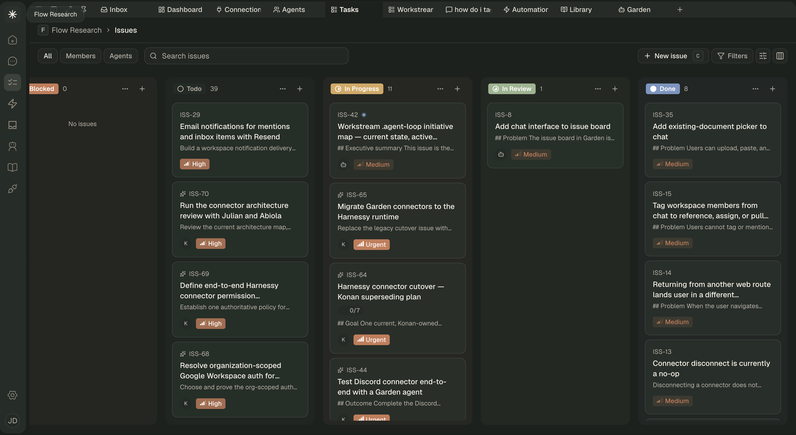
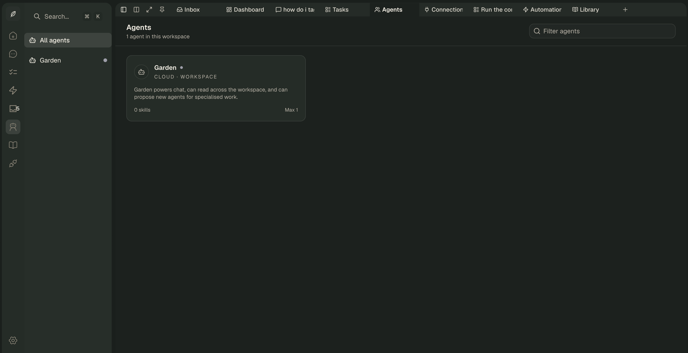
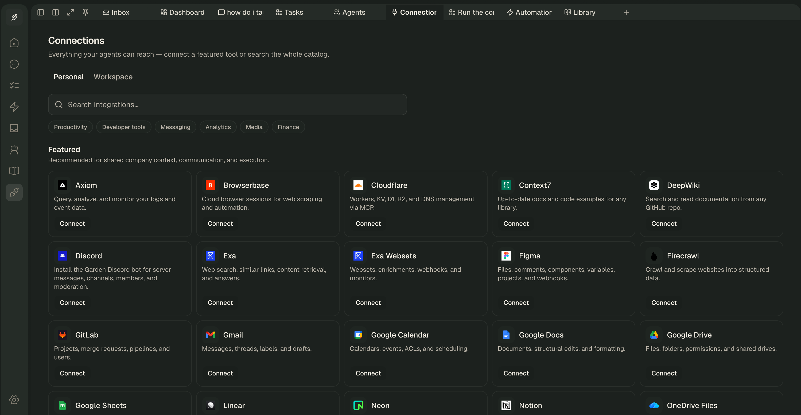
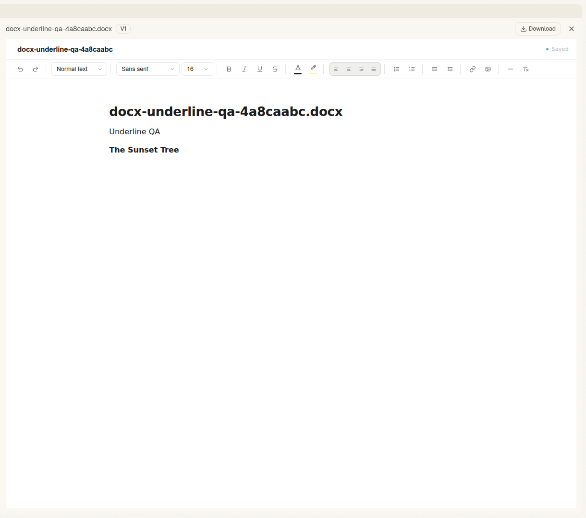

# Garden

Garden is an open-source workspace for people and AI agents. It brings chat,
tasks, automations, skills, connected tools, documents, and approvals into one
tabbed app, so a team can see what its agents are doing and decide what they are
allowed to do.

> Garden is under active development and is preparing for a small-user beta.
> Read the [roadmap](docs/roadmap.md) and
> [known gaps](docs/known-gaps/README.md) before using it in production.



_Garden's shared issue board, with work moving from blocked and todo through
review and done._

## What Garden does

- Gives each workspace a persistent agent that can chat, work through tasks,
  and run scheduled automations.
- Keeps human and agent work together instead of hiding agent activity in a
  separate console.
- Connects external tools while keeping permissions and approvals visible.
- Supports reusable [Agent Skills](https://agentskills.io) that belong to the
  workspace rather than one person's laptop.
- Opens chats, tasks, agents, skills, connections, inbox items, and automations
  in a persistent tabbed workspace.

Garden is built for cross-functional teams at small and mid-sized companies.
Developers use the same workspace to inspect agent work, build integrations and
skills, and keep technical work tied to shared tasks.

## Run Garden locally

Garden runs locally in two modes:

- **Offline mode** (`pnpm dev:offline`) — the recommended first run. No
  Cloudflare account, no sign-ups: the model runs on your machine through
  [Ollama](https://ollama.com), and everything else (database, storage,
  agents) is local too.
- **Standard mode** (`pnpm dev`) — the same local app, but model calls go to
  Cloudflare Workers AI. Needs a Cloudflare account on the Workers paid plan.

Both modes share the same setup through step 2, and both use the dockerized
local Postgres as the recommended database — a fresh, private instance that
migrations can own.

### Prerequisites

- [Node.js](https://nodejs.org) 22.12 or newer
- pnpm 10.33.0 — `corepack enable` installs the pinned version for you in
  step 1
- [Docker Desktop](https://www.docker.com/products/docker-desktop/) (or any
  Docker engine) — runs the local Postgres, and optionally the local model
- A Cloudflare account — **standard mode only**; skip it for offline mode

### 1. Clone and install

```bash
git clone https://github.com/Flow-Research/garden.git
cd garden

corepack enable
corepack install
pnpm install --frozen-lockfile
```

### 2. Create your environment file

```bash
cp .env.example .env
```

Then fill in the two required secrets in `.env`. Generate each one separately
(run the command twice; don't reuse one value):

```bash
openssl rand -base64 32
```

| Variable              | What to use                                          |
| --------------------- | ---------------------------------------------------- |
| `BETTER_AUTH_SECRET`  | First generated value                                |
| `EXECUTOR_SECRET_KEY` | Second generated value                               |

Everything else already has a working local default: `DATABASE_URL` points at
the local Docker Postgres from step 3, and `BETTER_AUTH_URL` /
`ENVIRONMENT` are preset. Connector and PostHog credentials are only needed
for features you explicitly configure.

That's all the configuration offline mode needs. For standard mode you will
also fill in `CLOUDFLARE_ACCOUNT_ID` — covered below.

### 3. Offline mode — no Cloudflare account

First, get a local model running. Pick one of these:

**Option A — Ollama in Docker** (no extra installs):

```bash
pnpm offline:up:ollama                                    # starts Postgres + Ollama
docker compose -f compose.dev.yaml exec ollama ollama pull qwen3:8b
```

**Option B — the Ollama app** (recommended on Apple Silicon: Docker
containers can't use the Mac GPU, so the native app is much faster):

```bash
# install from https://ollama.com, then:
ollama pull qwen3:8b
pnpm offline:up                                           # starts Postgres only
```

Heads up: `qwen3:8b` is a one-time **~5 GB download**, and the Docker images
on the first `pnpm offline:up` add a few hundred MB more. On a slow
connection, start the pull and get coffee.

Then migrate the database and start the app:

```bash
pnpm --filter @garden/db db:migrate
pnpm dev:offline
```

Open [http://localhost:3000](http://localhost:3000), create an account, then
create a workspace. That signup-to-workspace flow is the first-run health
check; if it works, everything works.

The model is configurable — any OpenAI-compatible API works, including hosted
ones when you want a stronger model without a Cloudflare account:

| Variable                            | Default                        | Notes                                   |
| ----------------------------------- | ------------------------------ | --------------------------------------- |
| `GARDEN_MODEL_BASE_URL`             | `http://localhost:11434/v1`    | Ollama; or e.g. `https://openrouter.ai/api/v1` |
| `GARDEN_MODEL_ID`                   | `qwen3:8b`                     | Must support tool calling               |
| `GARDEN_MODEL_API_KEY`              | unset                          | Required by hosted endpoints            |
| `GARDEN_MODEL_CONTEXT_WINDOW_TOKENS`| `32768`                        | Sizes context compaction                |

Offline limitations:

- DOCX import uses a local converter (mammoth) instead of Workers AI document
  conversion — fidelity is slightly reduced.
- Agent quality tracks the model you point at; small local models may fumble
  tool calls. A hosted endpoint fixes this without any Cloudflare setup.
- Automation browser runs are untested offline.

### 4. Standard mode — Cloudflare Workers AI

Sign in to Cloudflare and note your Account ID:

```bash
pnpm --filter @garden/web exec wrangler login
pnpm --filter @garden/web exec wrangler whoami
```

Copy the Account ID from `wrangler whoami` into `CLOUDFLARE_ACCOUNT_ID` in
`.env`. Then:

```bash
pnpm offline:up                        # local Postgres (skip if already running)
pnpm --filter @garden/db db:migrate    # skip if already migrated
pnpm dev
```

`pnpm dev` starts the app on port 3000 with local D1, R2, Durable Object, and
Workflow state, Hyperdrive pointed at `DATABASE_URL`, and the remote Workers
AI binding. Two things to know about that binding:

- it may incur usage on your Cloudflare account; and
- the default model (`@cf/moonshotai/kimi-k2.7-code`) requires the Workers
  **paid** plan — on the free plan, chat turns fail with a model-availability
  error. Use offline mode if you don't have a paid plan.

### Troubleshooting

**Model calls fail in offline mode:** check the endpoint answers
(`curl http://localhost:11434/v1/models`) and the model is pulled
(`ollama list`, or
`docker compose -f compose.dev.yaml exec ollama ollama list` for the Docker
option).

**Workers AI fails in standard mode:** run `wrangler whoami` again and check
that `CLOUDFLARE_ACCOUNT_ID` in `.env` belongs to the authenticated account.
If chat turns fail with a model-availability error, your account is on the
Workers free plan (see above).

**Database migrations fail:** confirm Docker is running and
`pnpm offline:up` reports the Postgres container healthy, then rerun
`pnpm --filter @garden/db db:migrate`. For a non-Docker database, check the
connection string and that the user can create and alter tables.

**Postgres port conflict:** the local Postgres maps port 55432 specifically
to avoid a system Postgres on 5432; if 55432 is also taken, override
`DATABASE_URL`.

**A connector is unavailable:** provider credentials are optional. Add only
the matching variables from `.env.example`, then restart the development
process.

**The full test suite cannot start Postgres:** start Docker first. Database
tests use Testcontainers and pull `postgres:16-alpine` on the first run.

**Port 3000 is already in use:** stop the process that owns the port. The
`pnpm dev:reset` helper uses broad process-name matching on macOS and Linux
and may stop unrelated Vite, Workerd, or esbuild processes, so use it
deliberately.

### Sandbox-container mode

`pnpm dev:containers` enables Cloudflare Sandbox containers. Core application
state still runs locally and Workers AI remains remote. This mode requires
Docker:

```bash
pnpm dev:containers
```

The tracked `apps/web/wrangler.containers.jsonc` works without account-specific
resource IDs. An ignored `apps/web/wrangler.containers.local.jsonc` can override
it when you deliberately need different bindings; never commit real account
IDs or credentials.

## Product tour

### Personal agents and shared work

Creating a workspace creates its default Garden agent. Chats, task runs, and
automation runs keep their own runtime context, while work and results remain
visible to the team. Garden can hand specific tasks to specialist agents while
keeping the main workspace simple.



_Every new workspace starts with its default Garden agent._

### Connections and permissions

Garden has native GitHub and Discord integrations and an Executor-backed
catalog for other providers. Catalog entries still need the relevant provider
credentials and setup before an agent can use them.



_The development catalog. Provider availability depends on local credentials
and runtime configuration._

Each connector tool has a risk class: `read`, `write`, `send_external`, or
`destructive`. Per-agent grants use three trust levels:

- `auto` is available for read-only tools that may run without pausing;
- `allow` lets the tool proceed and records the action in the audit trail; and
- `ask` pauses and sends an approval request to Garden's inbox.

Unknown tools fail closed instead of inheriting a permissive default.

### Skills

Garden supports the [Agent Skills](https://agentskills.io) format: a
`SKILL.md` file plus optional bundled resources. Skills belong to a workspace,
keep version history, and can be assigned to agents.

### Documents and artifacts

Agents and people work against the same document state. Uploaded DOCX files are
converted into versioned document blocks, edited inside Garden, and exported
back to DOCX or PDF.



_An imported DOCX edited and saved through Garden's document workspace._

## Architecture

```text
Browser ─── TanStack Start Worker ─── Neon Postgres (shared product data)
   │                  │
   │                  ├── Better Auth and server routes
   │                  ├── D1 and R2
   │                  └── Cloudflare Workflows
   │
   └── WebSocket ─── Agent Durable Object
                         │
                         ├── per-agent SQLite state
                         ├── Cloudflare Agents + Think runtime
                         ├── Executor integration session ─── providers
                         └── Cloudflare Sandbox for container tasks
```

Garden is Cloudflare-first. TanStack Start runs in a Worker, Durable Objects
host agent and Model Context Protocol (MCP) sessions, Workflows manage
long-running task and automation runs, and R2 stores files. Neon Postgres is the
source of truth for shared product data.

### Tech stack

| Layer                  | Technology                                                        |
| ---------------------- | ----------------------------------------------------------------- |
| Web app                | TanStack Start, React 19, TanStack Router                          |
| UI                     | Base UI, shadcn, Tailwind CSS v4                                   |
| Authentication         | Better Auth                                                        |
| Agent runtime          | Cloudflare Agents, Think, Durable Objects, Workflows               |
| Integration runtime    | Executor MCP plus Garden-native GitHub and Discord tools           |
| Code execution         | Cloudflare Sandbox and isolated JavaScript execution                |
| Shared database        | Neon Postgres with Drizzle ORM                                     |
| Agent and runtime data | Durable Object SQLite, D1, and R2                                  |
| Testing                | Vitest and Testcontainers                                          |
| Monorepo               | pnpm workspaces and Turborepo                                      |

For the deeper runtime model, read
[`docs/core/technical.md`](docs/core/technical.md).

## Repository map

```text
garden/
├── apps/web/                 # TanStack Start application and Worker entry
├── packages/agent-runtime/   # agents, workflows, tools, and execution
├── packages/app-state/       # client-side application state
├── packages/connectors/      # native integrations and provider policy
├── packages/core/            # shared product types and services
├── packages/db/              # Drizzle schema, migrations, and test helpers
├── packages/env/             # environment validation
├── packages/observability/   # logs, analytics, and error reporting
├── packages/server/          # shared server-side services
├── packages/ui/              # design system and reusable UI
├── workers/tail-observer/    # optional Worker log summaries
└── docs/                     # architecture, product, and operating notes
```

## Common commands

| Command                  | Purpose                                                        |
| ------------------------ | -------------------------------------------------------------- |
| `pnpm dev`               | Start the normal local app with remote Workers AI              |
| `pnpm dev:containers`    | Add Docker-backed Sandbox containers to the local app          |
| `pnpm lint`              | Run oxlint across the workspace                                |
| `pnpm typecheck`         | Generate Worker types and type-check the workspace             |
| `pnpm test`              | Run tests; Docker is required for database suites              |
| `pnpm build`             | Build the production application                               |
| `pnpm format`            | Check formatting                                               |
| `pnpm format:write`      | Apply the repository formatter                                 |
| `pnpm verify:connectors` | Check connector catalog and provider-policy coverage           |

Database commands:

| Command                                | Purpose                                |
| -------------------------------------- | -------------------------------------- |
| `pnpm --filter @garden/db db:generate` | Generate a migration from schema edits |
| `pnpm --filter @garden/db db:migrate`  | Apply pending migrations               |
| `pnpm --filter @garden/db db:check`    | Check migration consistency            |

## Project status

The current focus is a dependable small-user beta: workspace isolation, run
recovery, connector reliability, smoke coverage, and trustworthy approval and
audit paths. The [roadmap](docs/roadmap.md) tracks beta work and the longer
local-first, edge-native, cloud-optional direction. The
[known-gaps index](docs/known-gaps/README.md) separates current blockers from
future research so target architecture is not mistaken for shipped capability.

On-premises and fully self-hosted operation are not current capabilities. See
[`docs/core/DEFERRED.md`](docs/core/DEFERRED.md) for deliberate non-goals and
later work.

## Contributing

Start with [CONTRIBUTING.md](CONTRIBUTING.md). Connector contributions have two
paths—Executor-hosted integrations and Garden-native adapters—described in
[`docs/core/connectors.md`](docs/core/connectors.md).

Keep pull requests focused, include tests for behavior changes, and run the
checks that CI will run before asking for review. Report vulnerabilities
privately through [SECURITY.md](SECURITY.md).

## Documentation

| Document                                                               | Covers                                      |
| ---------------------------------------------------------------------- | ------------------------------------------- |
| [`docs/roadmap.md`](docs/roadmap.md)                                   | Beta priorities and longer product direction |
| [`docs/known-gaps/README.md`](docs/known-gaps/README.md)               | Current gaps and future research boundaries  |
| [`docs/core/PRD.md`](docs/core/PRD.md)                                 | Product requirements                        |
| [`docs/core/technical.md`](docs/core/technical.md)                     | Architecture and current implementation     |
| [`docs/design.md`](docs/design.md)                                     | Design system and interaction principles    |
| [`docs/core/connectors.md`](docs/core/connectors.md)                   | Connector runtime and contribution paths    |
| [`docs/core/realtime-foundation.md`](docs/core/realtime-foundation.md) | Realtime and polling boundaries             |
| [`docs/core/chat-runtime-model.md`](docs/core/chat-runtime-model.md)   | Chat and agent runtime model                |
| [`docs/core/DEFERRED.md`](docs/core/DEFERRED.md)                       | Deferred features and explicit non-goals    |

## License

Garden is licensed under the
[GNU Affero General Public License v3.0 only](LICENSE). The AGPL includes
network-use source-sharing requirements; read the license before distributing
or operating a modified version. Bundled third-party components keep their own
licenses and notices in [THIRD_PARTY_NOTICES.md](THIRD_PARTY_NOTICES.md).
