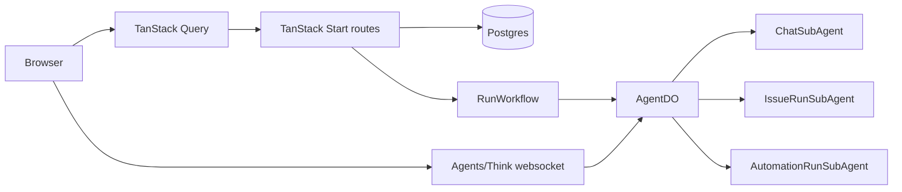

# Realtime foundation

**Status:** foundation note, code-reviewed 2026-05-24

Garden separates three kinds of live behavior:

1. durable product data in Postgres, rendered through TanStack Query;
2. live AI/chat streaming through Agents/Think websocket connections;
3. future workspace-wide cache/presence fanout through a dedicated realtime coordinator.

Only the first two are active today.

## Current implementation



Code evidence:

- `apps/web/src/components/web-providers.tsx` does not pass `wsUrl` into `CoreProvider`.
- `packages/app-state/src/realtime/provider.tsx` only opens `WSClient` when `wsUrl`, user, and workspace are all present.
- `apps/web/wrangler.jsonc` has no workspace realtime Durable Object binding.
- `apps/web/src/lib/issues/queries.ts` polls active run and run event endpoints every 2s while a run is active.
- `apps/web/src/features/chat/chat-runtime-provider.tsx` opens the chat websocket through `useAgent` / `useAgentChat` for the mounted chat panel.

## Ownership boundaries

| Layer | Owns today |
| --- | --- |
| Postgres | Durable business records: workspaces, agents, chat thread metadata, issues, runs, automations, connectors, documents, audit |
| TanStack Start routes/server services | Auth checks, CRUD, run start/cancel orchestration, query responses |
| TanStack Query | Browser cache and refetch/polling behavior |
| `AgentDO` | Agent identity, runtime RPC, child facet routing, Workflow creation |
| `ChatSubAgent` | Chat stream, Think messages, thread-local workspace/files/tools |
| `IssueRunSubAgent` / `AutomationRunSubAgent` | Live run turns and tools |
| `RunWorkflow` | Durable retry/wait/resume/cancel between Think turns |

## Future workspace realtime shape

When needed, add a workspace-scoped coordinator:

```md
WorkspaceRealtimeAgent
  name: workspaceId
  owns: live client sockets, presence, ephemeral fanout, normalized query invalidation signals
  does not own: durable records, chat history, run ledgers, or business decisions
```

Server write path:

1. authenticate and authorize;
2. write Postgres;
3. emit a normalized event to the workspace realtime coordinator;
4. clients invalidate or patch TanStack Query caches;
5. clients refetch authoritative data when needed.

Suggested event vocabulary should stay small:

```ts
type RealtimeEvent =
  | { type: 'query.invalidate'; workspaceId: string; keys: string[][] }
  | { type: 'entity.patch'; workspaceId: string; entity: string; id: string; patch: Record<string, unknown> }
  | { type: 'presence.update'; workspaceId: string; userId: string; state: 'online' | 'idle' | 'offline' }
```

## Constraints

- App-wide realtime must not share the AI chat transport.
- The bus should not become a second business database.
- Do not add fake websocket plumbing; leave `wsUrl` unset until a real server endpoint exists.
- Skill assignment and prompt invalidation should use explicit write-path signals or versioning, not broad client-side DB polling.
