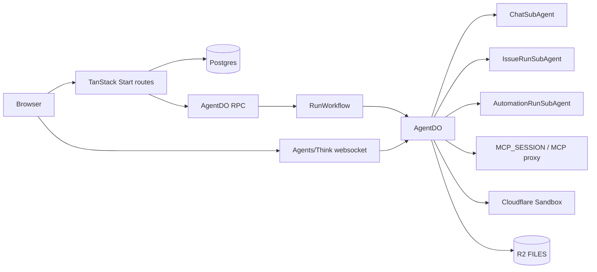

# Garden technical architecture

**Status:** current implementation map
**Last reviewed:** 2026-05-24
**Stack:** TanStack Start, React, Cloudflare Workers/Durable Objects/Workflows, Cloudflare Agents + Think, Neon Postgres, Drizzle, Better Auth, R2, Cloudflare Sandbox.

This document is code-backed. If it conflicts with a plan/spec elsewhere, prefer the files cited here.

## 1. Architecture overview

Garden has three planes:

1. **Control plane** — Postgres via Drizzle. Owns queryable product state: users, workspaces, agents, chat thread metadata, issues, runs, automations, skills, connectors, permissions, documents, and audit.
2. **Agent plane** — Cloudflare Durable Objects via the Agents SDK and Think. `AgentDO` is the parent runtime for one agent identity; child Think facets handle chats, issue runs, and automation runs.
3. **Execution plane** — Workflows for durable run orchestration, codemode for bounded JavaScript tool orchestration, Cloudflare Sandbox for shell/native/container execution, and MCP proxy sessions for connector tools.



## 2. Runtime topology

| Runtime | Responsibility | Code evidence |
| --- | --- | --- |
| `AgentDO` | Parent agent identity, access checks, callable RPC, Workflow creation, child facet routing | `packages/agent-runtime/src/agent-do.ts` |
| `ChatSubAgent` | One Think conversation per chat thread; thread-local workspace/docs/MCP registration | `packages/agent-runtime/src/agent-do.ts:905` |
| `IssueRunSubAgent` | Live issue-run Think turn, issue tools, work products, source bindings | `packages/agent-runtime/src/issue-run-sub-agent.ts` |
| `AutomationRunSubAgent` | Live automation-run Think turn and completion tool | `packages/agent-runtime/src/automation-run-sub-agent.ts` |
| `RunWorkflow` | Durable turn/retry/wait/resume/cancel boundary for issue and automation runs | `packages/agent-runtime/src/run-workflow.ts` |
| `AutomationTriggerDO` | Schedule trigger alarms and trigger-local concurrency state | `packages/agent-runtime/src/automation-trigger-do.ts` |
| `MCP_SESSION` | RPC MCP proxy session Durable Object | `workers/mcp-proxy/src`, binding in `apps/web/wrangler.jsonc` |
| `Sandbox` | Cloudflare Sandbox container binding for shell/native execution | `apps/web/wrangler.jsonc`, `packages/agent-runtime/src/sandbox-tools.ts` |

`apps/web/src/server.ts` exports the runtime classes and routes `/agents/agent-d-o/:name` to `getAgentByName(env.AgentDO, runtimeName)` after `requireAgentAccess()`.

## 3. Durable Object addressing

The runtime identity is data-driven:

- `agent.id` is the canonical agent row id.
- `agent.host_name` stores the runtime name when needed for migration/persistence.
- new rows can use the agent UUID as the `AgentDO` name.
- `AgentDO.agentRuntimeWhere()` resolves either UUID or `hostName`.

Chat threads do **not** get their own top-level `AgentDO`. A chat row binds to an agent and opens a child facet:

```ts
useAgent({
  agent: 'AgentDO',
  name: session.hostName,
  sub: [{ agent: 'ChatSubAgent', name: session.runtime_key }],
})
```

Server-side equivalent:

```ts
await this.subAgent(ChatSubAgent, threadId)
```

See `docs/core/chat-runtime-model.md`.

## 4. Data model

Key Drizzle schemas:

| Area | Tables / files |
| --- | --- |
| Agents | `packages/db/src/schema/agents.ts` — `agent` has `runtimeConfig`, `permissions`, `adapterType`, `hostName`, `runTimeoutSec` |
| Chat | `packages/db/src/schema/chat.ts` — `chat_thread.agentId`, `runtimeKind`, `runtimeKey`, `primaryIssueId` |
| Issues | `packages/db/src/schema/issues.ts`, `issue-values.ts` — issue ledger, run ledger, events, source bindings, work products, inbox dismissal |
| Automations | `packages/db/src/schema/automations.ts`, `automation-values.ts` — automations, triggers, runs |
| Capabilities/permissions | `packages/db/src/schema/capabilities.ts` — `capability`, `permission_grant`, `permission_request` |
| Audit | `packages/db/src/schema/audit.ts` — `tool_call_audit` |
| Documents | `packages/db/src/schema/documents.ts` — documents, versions, edits |
| Skills | `packages/db/src/schema/skills.ts` |
| Workspaces/users | `packages/db/src/schema/workspaces.ts`, `users.ts` |

Postgres is the authority for product/queryable state. Child Think facets keep local runtime state in Durable Object SQLite.

## 5. Long-running work

Issues and automations have separate ledgers but share runtime primitives.

### Issue run

1. API/server code calls `startIssueRun()` in `packages/server/src/issues/run-service.ts`.
2. The service creates/updates `issue_run` records and calls `AgentDO.startIssueRunWorkflow({ runId, issueId })`.
3. `AgentDO` creates `RUN_WORKFLOW` with `id: runId`.
4. `RunWorkflow` calls `AgentDO.executeRunTurn()` / `completeRunTurn()`.
5. `AgentDO` delegates to `IssueRunSubAgent(issueId)`.

### Automation run

1. route/trigger code calls `startAutomationRun()` in `packages/server/src/automations/run-service.ts`.
2. The service creates an `automation_run` row and calls `AgentDO.startAutomationRunWorkflow({ runId })`.
3. `RunWorkflow` calls `AgentDO.executeAutomationRunTurn()` / `completeAutomationRunTurn()`.
4. `AgentDO` delegates to `AutomationRunSubAgent(runId)`.

Do not add queue dispatch or issue-backed automation compatibility. Workflow instance id = run id.

## 6. Prompt/context layers

### Chat

`ChatSubAgent.configureSession()` wires:

1. `foundation` — `packages/agent-runtime/src/instructions/base.ts`
2. `agent` — Postgres agent name/role/instructions via `PostgresAgentPromptCatalog`
3. `workspace` — Postgres organization name/context
4. `skills` — assigned skills from R2 via Think-native `SkillSource`s created by `createGardenSkillSources`
5. cached prompt prefix

### Issue runs

`IssueRunSubAgent.configureSession()` wires `foundation` and bundled `issue-interaction` context.

### Automation runs

`AutomationRunSubAgent.configureSession()` wires `foundation`, `automation-run`, and `skills`.

Shared long-term memory and automatic active-task chat context are not dedicated chat prompt blocks today; see `docs/known-gaps/agent-runtime.md`.

## 7. Connectors and permissions

Connector model lives in `docs/core/connectors.md`.

Current code paths:

- connector manifests: `connectors/*/connector.ts`, `packages/connectors/src/registry.ts`;
- MCP proxy worker: `workers/mcp-proxy/src`;
- runtime MCP controller: `packages/agent-runtime/src/runtime-mcp-controller.ts`;
- capability/grant tables: `packages/db/src/schema/capabilities.ts`;
- permission derivation: `packages/core/agents/permissions.ts`;
- UI: `apps/web/src/features/connections/components/connections-page.tsx`.

Trust levels are `auto | allow | ask`. Do not use old PRD names like `ask_always`, `ask_on_risky`, or `never_ask` as schema/runtime terms.

## 8. Realtime and polling

Active today:

- chat streaming through Agents/Think websocket for mounted chat panels;
- issue active-run and event polling through TanStack Query (`apps/web/src/lib/issues/queries.ts`);
- inbox polling (`apps/web/src/lib/inbox/queries.ts`).

Inactive today:

- app-wide websocket bus. `CoreProvider` supports optional `wsUrl`, but `apps/web/src/components/web-providers.tsx` does not pass one and `apps/web/wrangler.jsonc` has no `BroadcastHub` / `WorkspaceRealtimeAgent` binding.

See `docs/core/realtime-foundation.md` and `docs/known-gaps/realtime-sync.md`.

## 9. Documents and execution

Document artifacts are implemented through:

- schema: `packages/db/src/schema/documents.ts`;
- tools/storage: `packages/agent-runtime/src/documents/*`;
- chat tool exposure: `packages/agent-runtime/src/chat-sub-agent-tools.ts`;
- routes: `apps/web/src/routes/api/documents/*`;
- UI: `apps/web/src/features/artifacts`, `apps/web/src/features/chat/components`.

Execution surfaces:

- codemode `execute` via `createExecuteTool` and `LOADER`;
- custom Cloudflare Sandbox tools via `packages/agent-runtime/src/sandbox-tools.ts` and `Sandbox` binding.

Think/Shell `Workspace` files and container `/workspace` files are separate stores until an explicit bridge ships.

## 10. Frontend shell

Current shell uses Dockview panels and a two-level sidebar.

Code evidence:

- layout: `apps/web/src/components/shell/workspace-layout.tsx`;
- sidebar rail contexts: `apps/web/src/components/shell/sidebar.tsx`;
- panels: `apps/web/src/components/shell/workspace-dock.tsx`;
- authenticated route: `apps/web/src/routes/_authenticated/workspace.tsx`.

Current panel kinds include dashboard, inbox, issues, issue-detail, automations, automation-detail, chat, agents, agent-detail, skill-editor, and capabilities. Settings is a dialog, not a primary route tab.

## 11. Wrangler bindings

`apps/web/wrangler.jsonc` defines:

- Durable Objects: `AgentDO`, `Sandbox`, `AUTOMATION_TRIGGER`, `MCP_SESSION`;
- Workflow: `RUN_WORKFLOW`;
- R2: `FILES`;
- worker loader: `LOADER`;
- browser binding: `BROWSER`;
- service binding: `MCP_PROXY`.

No `BROADCAST_DO`, `RUN_QUEUE`, `SUB_AGENT_DO`, or `PrimaryAgent` binding exists in the current config.

## 12. Testing and operations snapshot

Code-backed status is tracked in `docs/known-gaps/infrastructure.md`.

Current known gaps include pre-commit hooks, Playwright E2E, Sentry, staging environment, `/api/health`, and richer observability dashboards. CI exists in `.github/workflows/ci.yml`; connector CI exists in `.github/workflows/connectors.yml`.
