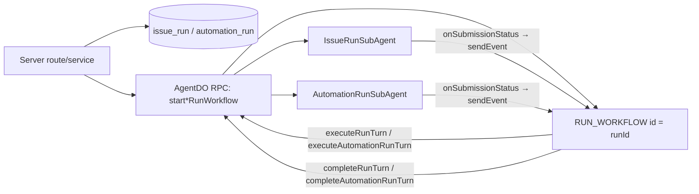

# Workflows engine (Think + Cloudflare Workflows)

**Status:** current, canonical
**Last reviewed:** 2026-07-24

This is the canonical design doc for Garden's durable run engine — the thing that turns an `issue_run` or `automation_run` row into an executing, resumable, cancellable Think agent loop. It supersedes the run-orchestration sections of `agent-runtime-rearchitecture.md`, `runtime-execution-boundaries.md` (Workflows section), `project-think-cloudflare.md` (long-running work section), and `automation-plan.md` (runtime lifecycle section) — those docs now point here for engine detail and keep only their surface-specific product content.

## What the engine is

Garden runs two product surfaces — **issues** and **automations** — through one shared durable executor:

- **Think** (`@cloudflare/think`) is the agent loop. It owns messages, tool calls, streaming, and a durable submission ledger (`submitMessages()`, `inspectSubmission()`, `onSubmissionStatus()`, `cancelSubmission()`).
- **`AgentWorkflow`** (`agents/workflows`) is Cloudflare Workflows wired to an originating Agent. Garden's `RunWorkflow` extends it. One Workflow instance per run, instance id = run id.
- **`AgentDO`** is the parent Durable Object and RPC surface. It hosts per-run Think facets as sub-agents (`IssueRunSubAgent`, `AutomationRunSubAgent`) and exposes the Workflow-facing RPC methods the Workflow calls back into.

The Workflow owns durability (retries, durable waits, resume/cancel, terminal bookkeeping). The DO/facet owns live runtime state, tools, MCP connections, and streaming. Neither owns both.

## Code map

| Concern | Owner | Evidence |
| --- | --- | --- |
| Durable executor | `RunWorkflow extends AgentWorkflow` | `packages/agent-runtime/src/run-workflow.ts` |
| Agent identity / RPC parent | `AgentDO extends Agent` | `packages/agent-runtime/src/agent-do.ts` |
| Issue run facet | `IssueRunSubAgent extends Think`, keyed by issue id | `packages/agent-runtime/src/issue-run-sub-agent.ts` |
| Automation run facet | `AutomationRunSubAgent extends Think`, keyed by run id | `packages/agent-runtime/src/automation-run-sub-agent.ts` |
| Issue ledger | `issue_run`, `issue_run_event` | `packages/db/src/schema/issues.ts`, `packages/db/src/schema/issue-values.ts` |
| Automation ledger | `automation`, `automation_trigger`, `automation_run` | `packages/db/src/schema/automations.ts`, `packages/db/src/schema/automation-values.ts` |
| Run start services | `startIssueRun`, `startAutomationRun` | `packages/server/src/issues/run-service.ts`, `packages/server/src/automations/run-service.ts` |
| Schedule trigger state | `AutomationTriggerDO` | `packages/agent-runtime/src/automation-trigger-do.ts` |
| Wrangler bindings | `AgentDO`, `RUN_WORKFLOW`, `AUTOMATION_TRIGGER` | `apps/web/wrangler.jsonc` |

## Architecture



## Lifecycle, turn by turn

1. **Start.** A server route/service inserts the run row (`issue_run` or `automation_run`, status `queued`/`pending`), then calls `AgentDO.startIssueRunWorkflow` / `startAutomationRunWorkflow`.
2. **Workflow creation.** The DO calls `this.runWorkflow('RUN_WORKFLOW', { kind, runId, ... }, { id: runId, agentBinding: 'AgentDO', metadata })`. Instance id = run id is the idempotency boundary — a duplicate create (`isDuplicateWorkflowInstanceError`) is treated as success, not an error.
3. **Turn submit.** `RunWorkflow.run()` loops (`MAX_TURNS = 200`). Each turn calls `step.do('turn-N-submit', { retries: 3, exponential, 5s } , ...)` → `AgentDO.executeRunTurn` / `executeAutomationRunTurn` → the owning facet's `executeWorkflowTurn(mode, input)`.
4. **Facet submits to Think.** The facet calls `this.submitMessages([message], { submissionId, idempotencyKey: submissionId, metadata: { runId, ... } })` and returns immediately — it does not block on completion. This returns either `{ kind: 'stopped' }` (e.g. cancel already requested) or `{ kind: 'submitted', submissionId, status }`.
5. **Durable wait.** If the submission isn't already terminal, the Workflow calls `step.waitForEvent(...)` on a per-submission event type (`run-turn-complete:<submissionId>`). No DO-local timer, no in-memory waiter map — the wait is fully durable Workflow state.
6. **Wake.** Think calls the facet's `onSubmissionStatus(submission)` override when a submission reaches a terminal status (`completed | aborted | skipped | error`). The facet looks up `runId` from submission metadata and does `env.RUN_WORKFLOW.get(runId).sendEvent({ type: 'run-turn-complete:<submissionId>', payload })`.
7. **Turn complete.** The Workflow's `step.do('turn-N-complete-status', ...)` calls `AgentDO.completeRunTurn` / `completeAutomationRunTurn` → the facet's `completeWorkflowTurn`, which inspects the submission and resolves Garden's product-ledger status (handles `error` → force-close failed, `aborted` → cancel-if-requested else force-close failed, `skipped` → force-close failed as `turn_skipped`).
8. **Branch on status.**
   - Terminal (`succeeded | completed | failed | cancelled | blocked | skipped`): `step.reportComplete(...)`, Workflow returns.
   - Awaiting (`waiting_for_input | waiting_for_approval` — issue runs only today): Workflow calls `step.waitForEvent('resume-N', { type: 'run-control' })`. No event within the wait, or a `cancel` payload, drives the cancel branch (`AgentDO.cancelIssueRun` / `cancelAutomationRun`, then `reportComplete({ status: 'cancelled' })`). A `resume` payload sets `mode = 'resume'` and loops to step 3.
   - Anything else (a run-status result that isn't terminal and isn't an awaiting status): treated as complete as-is.
9. **Turn cap.** After 200 turns without reaching a terminal/awaiting resolution, the Workflow reports `max_turns_exceeded` and returns.

## Two ledgers, one engine

| Surface | Ledger | Status vocabulary | Awaiting/HITL states |
| --- | --- | --- | --- |
| Issues | `issue_run` (`issue-run-status` check) | `queued, running, waiting_for_input, waiting_for_approval, succeeded, failed, cancelled, blocked` | Yes — issue runs can pause on `mark_blocked`, questions, or approval gates and resume via `run-control` events. |
| Automations | `automation_run` | `pending, queued, running, completed, failed, cancelled, skipped` | None today — automation runs currently resolve to a terminal status in one pass; the Workflow's generic `AWAITING_RUN_STATUSES` set is issue-shaped, not exercised by automations yet. |

`RunWorkflow`'s `TERMINAL_RUN_STATUSES` and `AWAITING_RUN_STATUSES` (in `run-workflow.ts`) are the union across both ledgers, not per-surface enums — that's intentional (one generic loop), but it means the Workflow doesn't itself enforce which statuses are valid for which `kind`. Ledger-shape correctness is enforced by each facet's DB check constraints and by `completeWorkflowTurn`.

An automation run must never create an issue, appear on the kanban, or route through `issue_run` — if an automation's domain task needs to touch issues, that's explicit tool work inside the automation's prompt, not orchestration.

## Resume and cancel

Both are Workflow control events, sent to the instance keyed by `runId`:

```ts
const instance = await env.RUN_WORKFLOW.get(runId)
await instance.sendEvent({ type: 'run-control', payload: { kind: 'resume' | 'cancel' } })
```

`AgentDO.cancelIssueRun` / `cancelAutomationRun` additionally call `requestCancel` on the live facet and `abortSubAgent(...)` to stop in-flight tool/model work immediately, rather than waiting for the next Workflow step.

## Automation scheduling

`AutomationTriggerDO` is a separate Durable Object that owns schedule-trigger state — it is not part of the run engine's turn loop, it's what *starts* a scheduled run. It computes the next fire time from `cronExpression` + `timezone`, creates a one-time Agents SDK schedule (`scheduleAutomationTrigger`), and on fire applies the automation's `concurrencyPolicy` (`skip` is the implemented/safe default; `replace` marks the in-flight run replaced; `queue` is schema-only, not implemented — do not expose it in product UI) before inserting the `automation_run` row and calling `AgentDO.startAutomationRunWorkflow`. Manual/webhook/API-triggered runs skip this DO and converge on the same `automation_run` + `AgentDO` + `RunWorkflow` path.

## `Think` durable submissions vs the old model

Before durable submissions, the DO waited in-process for a turn to finish (arbitrary timers, an in-memory callback map) — long tool calls could blow past that window even though Think was still working correctly. The current model removes that layer entirely: Think's submission ledger is the source of truth for "is this turn done," `onSubmissionStatus` is the only wake path, and the Workflow's `waitForEvent` is the only wait path. There is no DO-local waiter, no polling loop, and no second recovery layer — if you're tempted to add one, that's a sign something upstream (Think or Workflows) has a gap that should be named and linked, not routed around.

## Design rules

- Do not add `RUN_QUEUE`, a dispatcher, or queue consumers between `AgentDO` and `RunWorkflow`. Workflow instance id = `runId` is the idempotency boundary.
- Do not monkey-patch SDK lifecycle methods (`restoreConnectionsFromStorage`, `submitMessages`, etc.) or destructure/reassign methods off `this` — that silently breaks `this` binding.
- Do not rebuild a DO-local waiter/timeout layer. Use `submitMessages()` + `onSubmissionStatus()` + `Workflow.waitForEvent()`.
- Do not route automation execution through `issue_run`, or model automations as issues.
- If Workflow creation fails, fail that ledger row's start explicitly. Don't hide it behind a second queue/reconciler unless a *current, linked* Cloudflare platform gap requires it.
- Keep issue-run code issue-specific and automation code automation-specific; share only the product-neutral primitives (`RunWorkflow`, model/tool setup, MCP controller patterns).

## Where Workflows stops being the right tool

Not all durable-ish work belongs on `RunWorkflow`. Product runs (issue/automation) have explicit run ids, DB status, audit events, user-visible cancel, and durable Think-submission waits — that's exactly what Workflows is for. Agent-local background work that isn't itself a product run (connector capability refreshes, cache/materialization, non-critical sandbox cleanup, agent maintenance) belongs on managed fibers (`startFiber`, `inspectFiber`, `cancelFiber`, `FiberContext.signal`) instead — SDK-native inspection/cancellation without a run ledger. Sandbox quick tunnels are preview transport for live artifacts, not durable storage; accepted artifacts persist separately in Garden storage.

## Open gaps

| Gap | Notes |
| --- | --- |
| Prove the full lifecycle in staging | Start, wait, resume, cancel, failure, recovery, duplicate-start prevention, terminal visibility — for both run kinds, end to end through `RunWorkflow`. |
| `queue` concurrency policy | Schema value exists (`automationConcurrencyPolicyValues`); `AutomationTriggerDO.applyConcurrencyPolicy` does not implement it. Implement end to end or drop it from the type until it is. |
| Webhook/API trigger hardening | Typed auth, replay/idempotency protection, and attribution for `automation_trigger.kind = webhook | api`. |
| Automation awaiting states | If automations ever need HITL pause/resume (approval, clarifying question), the Workflow loop already supports it generically — the gap is in `AutomationRunSubAgent` producing `waiting_for_*`-shaped statuses, not in the engine. |
